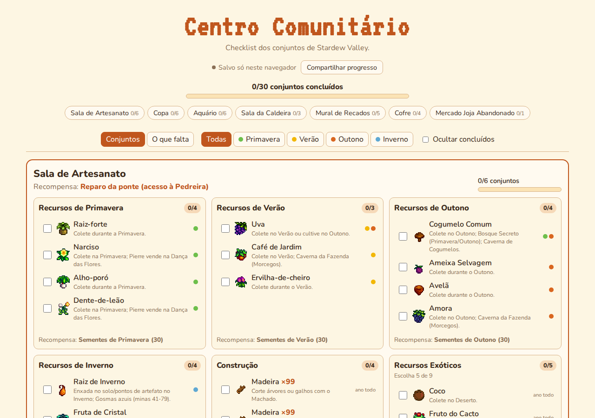

# 🌱 Stardew Check — Centro Comunitário

Checklist dos conjuntos do Centro Comunitário de Stardew Valley, com progresso salvo e compartilhável para co-op.

### 👉 [stardew-check.vercel.app](https://stardew-check.vercel.app)



## Funcionalidades

- ✅ **Todos os conjuntos** das 6 salas, mais o Mercado Joja Abandonado, com checkbox em cada item
- 💾 **Progresso salvo** no navegador, sem precisar criar conta
- 🤝 **Compartilhar progresso:** gera um link (`?fazenda=...`), e todo mundo que abrir marca na mesma lista (ótimo para co-op)
- 🌸 **Filtro por estação:** destaca o que dá para conseguir agora
- 📋 **O que falta:** lista tudo o que ainda precisa, somando as quantidades
- 💡 Onde conseguir cada item, a quantidade e a qualidade exigida
- 🎯 Conjuntos do tipo "escolha 5 de 9" contam como completos ao atingir o mínimo
- 🌙 Modo escuro automático e layout para celular

> Usa a versão **padrão** dos conjuntos (não a remixada). Dados da [Stardew Valley Wiki em português](https://pt.stardewvalleywiki.com/Conjuntos).

## Encontrou um erro?

Abra uma [issue](https://github.com/oJotagee/stardew-check/issues) ou mande um PR. Os dados dos conjuntos ficam todos em [`src/data.ts`](src/data.ts).

---

## Para desenvolvedores

Feito com React + TypeScript + Vite. Hospedado na Vercel, com banco Postgres no [Neon](https://neon.tech) para o progresso compartilhado.

### Rodar local

Só o front (o compartilhamento fica indisponível, o resto funciona):

```bash
npm install
npm run dev
```

Com a API e o banco:

```bash
npx vercel link
npx vercel env pull .env.local
npx vercel dev
```

### Deploy na Vercel

1. Importe o repositório na Vercel (ela detecta o Vite sozinha).
2. Em **Storage → Create Database → Neon**, conecte o banco ao projeto. Isso cria a variável `DATABASE_URL`.
3. Faça um **Redeploy** para a variável valer.

A tabela é criada automaticamente na primeira chamada da API.

### Estrutura

| Arquivo | O que faz |
|---|---|
| `src/data.ts` | Conjuntos, itens, estações e dicas |
| `src/useProgress.ts` | Estado, localStorage e sincronização |
| `src/App.tsx` | Interface |
| `api/progresso.ts` | Função serverless (GET/POST/DELETE) usando o Neon |
| `scripts/download-icons.ts` | Baixa os ícones da wiki para `public/icons` (`npm run icons`) |

## Créditos

Stardew Valley e seus ícones © [ConcernedApe](https://www.stardewvalley.net/). Projeto de fã, sem fins lucrativos e sem afiliação oficial.
